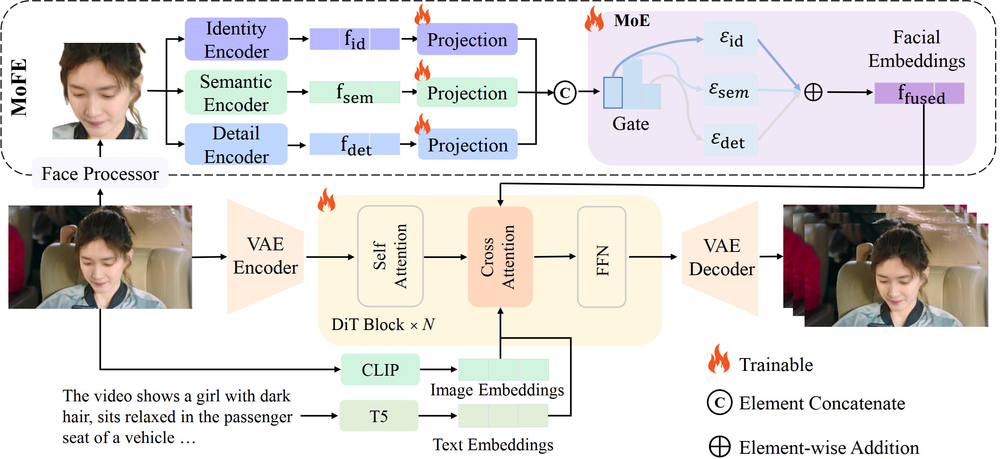
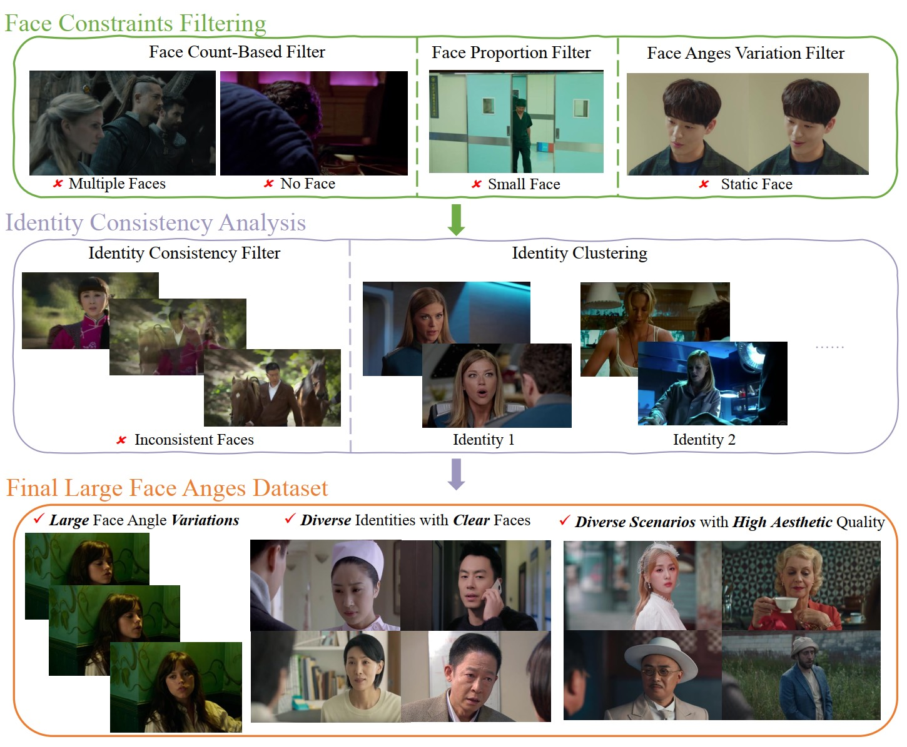

# From Large Angles to Consistent Faces: Identity-Preserving Video Generation via Mixture of Facial Experts

[](https://arxiv.org/abs/2508.09476)
[](https://rain152.github.io/LFA-Video-Generation)

This repository is the official implementation of *MoFE*, a novel identity-preserving Image-to-Video (I2V) generation method specifically designed for challenging large facial angle scenarios.

## Abstract

Current video generation models struggle with identity preservation under large facial angles, primarily facing two challenges: the difficulty in exploring an effective mechanism to integrate identity features into DiT structure, and the lack of targeted coverage of large facial angles in existing open-source video datasets. To address these, we present two key innovations. First, we introduce a *Mixture of Facial Experts (MoFE)* that dynamically combines complementary cues from three specialized experts, each designed to capture distinct but mutually reinforcing aspects of facial attributes. The identity expert captures cross-pose identity-sensitive features, the semantic expert extracts high-level visual semantxics, and the detail expert preserves pixel-level features (*e.g.,* skin texture, color gradients). Furthermore, to mitigate dataset limitations, we have tailored a data processing pipeline centered on two key aspects: *Face Constraints* and *Identity Consistency*. Face Constraints ensure facial angle diversity and a high proportion of facial regions, while Identity Consistency preserves coherent person-specific features across temporal sequences, collectively addressing the scarcity of large facial angles and identity-stable training data in existing datasets. Leveraging this pipeline, we have curated and refined a Large Face Angles (LFA) Dataset from existing open-source human video datasets, comprising 460K video clips with annotated facial angles. Experimental results on the LFA benchmark demonstrate that our method, empowered by the LFA dataset, significantly outperforms prior SOTA methods in face similarity, face FID, and CLIP semantic alignment. 

## Method Overview



Our approach integrates three specialized experts through a dynamic mixture mechanism, enabling robust identity preservation under challenging viewing conditions.

## Data Processing Pipeline



The data processing pipeline ensures high-quality training data with proper facial angle coverage and identity consistency.

## Citation
If you find our paper and code useful in your research, please consider giving a star and citation.
```bibtex
@article{mofe2025,
  title={From Large Angles to Consistent Faces: Identity-Preserving Video Generation via Mixture of Facial Experts},
  author={Your Name and Others},
  journal={arXiv preprint},
  year={2025}
}
```

## License

This project is licensed under the MIT License - see the [LICENSE](LICENSE) file for details.

## Acknowledgments

- Thanks to the open-source community for providing base datasets
- Special thanks to contributors of CogVideoX, LTX-Video, and ConsisID for comparison baselines
